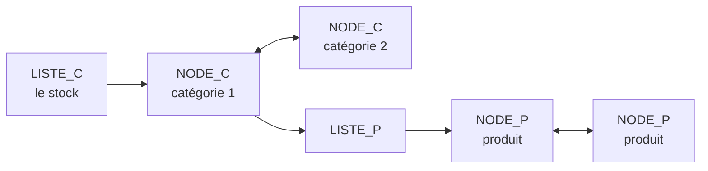

# Gestion de stock en C

Programme en C de gestion d'un stock organisé en catégories et en produits, construit sur des listes doublement chaînées, avec tris et sauvegarde dans un fichier CSV.

## Présentation

- **Cadre** : projet d'informatique de base, première année du cycle ingénieur Instrumentation, Sup Galilée (Université Sorbonne Paris Nord).
- **Équipe** : projet réalisé en binôme avec Sarah Dahmoun.
- **État** : terminé dans son cadre académique, non maintenu.

## Fonctionnalités

- Ajout, suppression et modification de catégories.
- Ajout et suppression de produits, mise à jour des prix et des quantités.
- Tris des produits : alphabétique, prix croissant, prix décroissant, quantité disponible.
- Chargement du stock depuis un fichier CSV au démarrage et sauvegarde à la sortie.

## Structures de données

Le choix s'est porté sur la liste chaînée plutôt que sur un tableau statique : la taille du stock varie, et les insertions et suppressions sont fréquentes.



| Type | Contenu |
|---|---|
| `PRODUIT` | Nom, prix, quantité |
| `NODE_P` | Un produit, pointeurs `next` et `previous` |
| `LISTE_P` | Pointeurs `first` et `last` sur les produits d'une catégorie |
| `CATEGORIE` | Nom et liste de produits |
| `NODE_C` | Une catégorie, pointeurs `next` et `previous` |
| `LISTE_C` | Pointeurs `first` et `last` sur les catégories : le stock complet |

## Contenu du dépôt

| Fichier | Rôle |
|---|---|
| [`src/main.c`](src/main.c) | Programme principal : charge le fichier passé en argument, lance le menu de gestion, sauvegarde |
| [`src/projet.h`](src/projet.h) | Types structurés et prototypes |
| [`src/projet.c`](src/projet.c) | Affichage, tris, actions sur les produits et les catégories, lecture et écriture du CSV |
| [`exemple/stock.csv`](exemple/stock.csv) | Petit fichier d'exemple au format `catégorie;produit;prix;quantité;` |
| [`docs/`](docs) | Rapport du projet |

## Compilation et utilisation

```bash
gcc src/main.c src/projet.c -o gestion_stock
./gestion_stock exemple/stock.csv
```

Le programme affiche le stock, propose d'ajouter, supprimer ou modifier une catégorie, puis réécrit le fichier à la sortie. La compilation avec `gcc` et le chargement du fichier d'exemple ont été vérifiés.

## Algorithmes

- **Tris** : tri par sélection directement sur la liste chaînée (on échange le contenu des nœuds, pas les nœuds). La comparaison alphabétique utilise `strcoll`.
- **Chargement** : lecture ligne par ligne avec `fgets`, découpage avec `strtok` sur le séparateur `;`, création d'une nouvelle catégorie à chaque changement de nom.

## Limites

- **Deux prototypes corrigés** dans `projet.h` (`tri_alphabetique` et `ajout_categorie`) : leur type ne correspondait pas à la définition, ce qui empêchait la compilation avec `gcc`. Le reste du code est inchangé.
- **Tri par quantité** : la fonction `tri_quantite_dispo` compare les prix au lieu des quantités.
- **Menu** : il manque un `break` après le cas « modifier une catégorie », et la recherche de catégorie ne repart pas du début de la liste au second passage.
- **Mémoire** : les nœuds supprimés et les listes ne sont pas libérés (`free`).
- **Saisie** : `scanf("%s")` sans limite de longueur, noms sans espace uniquement.
- **Tests** : aucun test automatisé.

## Licence

Aucune licence n'a été définie pour ce code.
