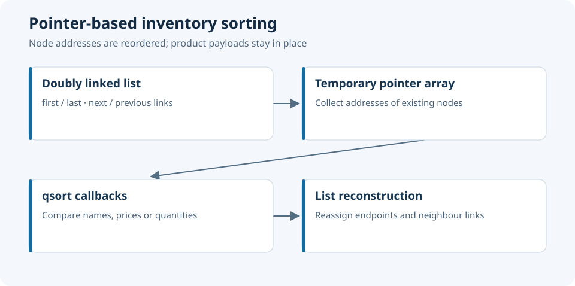

# C Inventory Structures — Pointers and Memory Management

C inventory exercise implementing checked heap allocation, doubly linked lists and pointer-based sorting.



**C11 · Heap Allocation · Structs · Pointer Indirection · Linked Lists · Function Pointers · qsort**

Sorting changes the order of node addresses and rebuilds their links; product records retain their storage locations. Memory ownership, pointer indirection and list invariants are the core engineering topics.

## Project Overview

| Item | Details |
|---|---|
| Context | First-year Instrumentation engineering coursework |
| Authors | Tedj El Moulk Sinacer and Sarah Dahmoun |
| Execution model | Hosted C console application |
| Demo | Two products in one category |
| Operations | Checked insertion, display, four sorting orders and cleanup |
| Build | C11 compiler and Make |

The project develops C skills relevant to embedded software through a standard host application.

## Technical Scope

The implementation uses tagged self-referential structures, checked heap allocation, reciprocal node links and function-pointer comparison callbacks. It preserves node identity during sorting and provides an explicit ownership lifecycle.

## Data Model

| Type | Contents |
|---|---|
| `PRODUIT` | Name, float price and integer quantity |
| `NODE_P` | Product payload, next and previous pointers |
| `LISTE_P` | First and last node pointers |
| `CATEGORIE` | Category name and borrowed list-descriptor pointer |
| `NODE_C`, `LISTE_C` | Retained category-list declarations |

`STOCK_NAME_CAPACITY = 200` includes the null terminator. Insertion rejects names longer than 199 bytes, negative quantities, negative prices and nonfinite prices.

### Memory Layout and Ownership

The demo owns its list descriptor on the stack. `stock_add()` allocates nodes owned by the list; `stock_clear()` releases them and nulls both endpoints. The category borrows the descriptor pointer.

Sorting temporarily allocates `n * sizeof(NODE_P *)` bytes. The array aliases the original nodes and is released after relinking. Allocation failure returns `false` before changing the list. Every caller checks the result and follows a cleanup path.

## Allocation and Link Initialization

```c
LISTE_P products = {NULL, NULL};
CATEGORIE fruits = {"fruits", &products};
if (!stock_add(&products, "Banana", 1.25f, 200)) {
    /* Handle failure; the list is unchanged. */
}
/* Use the list, then release its nodes. */
stock_clear(&products);
```

Appending establishes both the new backward link and the previous endpoint's forward link. Cleanup also accepts an empty list.

## Pointer-Based Sorting

### Algorithm Used by the Source

1. Count nodes and check the temporary-array size.
2. Allocate an array of node addresses.
3. Sort with `qsort()` and the requested comparison callback.
4. Reverse the pointer order for a descending sort.
5. Rebuild both links of every node and update both endpoints.
6. Release the pointer array.

Empty and singleton lists are successful no-op cases. Equal-key nodes may have either relative order; sorting is not guaranteed to be stable.

| Function | Order |
|---|---|
| `tri_alphabetique()` | Name ascending |
| `tri_prix_croissant()` | Price ascending |
| `tri_prix_decroissant()` | Price descending |
| `tri_quantite_dispo()` | Quantity descending |

All sorting functions accept `CATEGORIE *` and return `bool`. Display is separate from sorting.

### Comparator Indirection

Each array element is a `NODE_P *`; the callback receives the address of that pointer:

```c
const NODE_P *product = *(NODE_P * const *)element;
```

### Price Comparator

Relational comparison preserves fractional differences:

```c
return (price_a > price_b) - (price_a < price_b);
```

Prices remain floats for this coursework exercise. The insertion API restricts the domain to finite, nonnegative values. Monetary accounting would require its own rounding and representation policy.

## List Invariants

| Condition | Invariant |
|---|---|
| Empty list | Both endpoints are null |
| Nonempty list | `first->previous == NULL` |
| Nonempty list | `last->next == NULL` |
| Forward neighbour | `node->next->previous == node` |
| Backward neighbour | `node->previous->next == node` |

Regression tests traverse both directions and retain an original node address across repeated sorts.

## Resource and Embedded-C Considerations

Collection and relinking are linear passes. Sorting behaviour depends on the library's `qsort()` implementation. The temporary allocation is sized from the node count with an overflow check.

The API assumes a well-formed, acyclic list built through its insertion operation. Direct structure modifications must preserve the same invariants. A microcontroller adaptation could use a fixed-capacity pool in place of the host heap.

## Repository Structure

| Path | Contents |
|---|---|
| [include/gestion_de_stock.h](include/gestion_de_stock.h) | Canonical types, ownership rules and API |
| [src/main.c](src/main.c) | Runnable demonstration |
| [src/stock.c](src/stock.c) | Insertion, cleanup, display and sorting |
| [tests/test_stock.c](tests/test_stock.c) | Regression tests and allocation-failure injection |
| [Makefile](Makefile) | Build, test and sanitizer commands |

The former `codes`, `fonction definition.c` and duplicate root headers are consolidated into this layout. Coursework API names remain consistent across declarations, implementation and tests.

## Build and Run

```bash
git clone https://github.com/tedjelmoulksn-dotcom/Gestion-du-stock-en-C.git
cd Gestion-du-stock-en-C
make
./build/inventory_demo
make test
make sanitize
```

Tests use GNU-compatible linker wrapping to inject allocation failures without changing production code. The sanitizer target enables AddressSanitizer and UndefinedBehaviorSanitizer.

## Implementation Review

One canonical header, correctly tagged node types and matching signatures make the project buildable. Count-based sorting allocation replaces the fixed 500-pointer buffer. Shared relinking logic maintains both endpoints, and cleanup completes memory ownership.

## Verification

Tests cover empty, singleton and multi-node lists; duplicate keys; fractional prices; invalid input; allocation failures; repeated sorting; and a 600-node list. Allocation accounting verifies complete release of the tested node and sort-array allocations.

## Authors and Licensing

Developed by **Tedj El Moulk Sinacer** and **Sarah Dahmoun**.

No explicit project licence is included.
